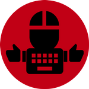

# Click and Clack

> Super simple application for clicking mouse button and clacking key button in defined intervals.


## How to get

- [Download](https://github.com/houby-studio/clickandclack/releases/latest)
- Install with one click
- Launch
- Enjoy clicking and clacking!

> Currently only Windows installer is available.

## How to use

### Main window

allows you to set:

- How often mouse clicks, in seconds
- What key does program clack
- How often keyboard clacks, in seconds


From main window, you can click on:
- mouse icon, which opens mouse settings
- keyboard icon, which opens special keys

From window toolbar, you can click on:
- settings icon, which opens application settings
- minimize and exit icons

### Mouse settings

allows you to set:
- Whether mouse clicks with **left** or right button
- Whether mouse makes **single click** or double click


### Keyboard settings

allows you to set:
- special key to press


### Application settings

allows you to set:
- Whether window is always on top or **not**
- Whether random delay of up to 5 seconds applies on each trigger or **not**
- Whether clicking is **enabled** or disabled
- Whether clacking is **enabled** or disabled


## Developing

## Install the dependencies
```bash
yarn
```

### Start the app in development mode (hot-code reloading, error reporting, etc.)
```bash
quasar dev -m electron
```

> If build fails due to native module [robotjs](https://robotjs.io/docs/electron), customize 'rebuild' script to run against your electron version and run `yarn rebuild` before running build

### Build the app for production
```bash
quasar build -m electron
```

## [MIT License](LICENSE)

> Brought to you by 🍄 Houby Studio